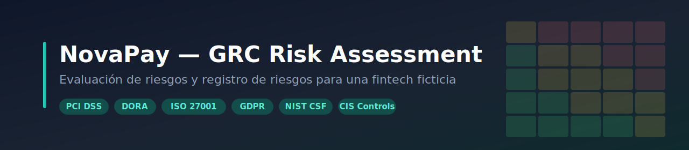

<p align="center">
  
</p>

# NovaPay — Evaluación y Registro de Riesgos (GRC)

> Proyecto de portfolio que documenta una **evaluación de riesgos de seguridad de la información** de punta a punta para una fintech ficticia, **NovaPay**, aplicando metodología cualitativa de riesgo (probabilidad × impacto) y los principales marcos de Gobernanza, Riesgo y Cumplimiento.

Este repositorio demuestra, sobre un caso de negocio realista, el ciclo completo de gestión de riesgo: **definición del contexto → metodología → identificación y valoración de riesgos (inherente y residual) → selección de controles → plan de tratamiento → indicadores (KPI/KRI) → reporte ejecutivo.**

---

## 1. Contexto de negocio — NovaPay

**NovaPay** es una fintech ficticia que opera una **pasarela de pagos y billetera digital**.

| Atributo | Valor |
|---|---|
| Sector | Pagos / Fintech |
| Tamaño | Mediana (~300 empleados) |
| Infraestructura | Híbrida (nube + datacenter propio) |
| Apetito de riesgo | Medio (residual aceptable hasta nivel Medio, ≤ 12) |
| Mercado | Unión Europea |

**Activos críticos:** pasarela de pagos, portal de clientes, entorno de datos de tarjeta (CDE), almacenamiento en la nube, proveedor cloud crítico y datacenter propio.

**Marcos y regulaciones aplicables** (y sus dependencias):

- **PCI DSS** + **CIS Controls** — por procesar pagos con tarjeta.
- **DORA** + **ISO/IEC 27001 / 27005** + **NIST CSF** — por ser entidad financiera que opera en la UE (resiliencia operativa).
- **GDPR** — por tratar datos personales de clientes europeos (notificación de brechas en 72 h, DPA con terceros).

---

## 2. Metodología

La evaluación usa un enfoque **cualitativo** de **probabilidad × impacto**, con escalas de 1 a 5 y una matriz 5×5.

**Nivel de riesgo = Probabilidad × Impacto** (rango 1–25), clasificado en tres bandas:

| Banda | Rango | Acción según apetito medio |
|---|---|---|
| 🟢 Bajo | 1 – 4 | Aceptar con seguimiento |
| 🟡 Medio | 5 – 12 | Plan de mitigación y monitoreo |
| 🔴 Alto | 15 – 25 | Prevenir / mitigar de inmediato |

Cada riesgo se valora **dos veces**:

- **Riesgo inherente** — nivel sin considerar controles.
- **Riesgo residual** — nivel tras aplicar los controles, que debe quedar dentro del apetito.

> **Principio aplicado:** los **controles preventivos** (MFA, cifrado, parches) reducen la **probabilidad**; los **controles correctivos / de recuperación** (DRP, backups, redundancia) reducen el **impacto**. La transferencia contractual (SLA, seguros) **no reduce el impacto** de una fuga de datos: solo traslada parte de la exposición financiera.

---

## 3. Registro de riesgos

Se identificaron y valoraron **10 riesgos** cubriendo las tres dimensiones de GRC: técnica, operativa y de cumplimiento.

| ID | Riesgo | Activo | Inherente | Tratamiento | Residual | Apetito |
|---|---|---|:---:|:---:|:---:|:---:|
| R-01 | Intercepción/alteración en la pasarela (MITM) | Pasarela de pagos | 🟡 9 | Mitigar | 🟡 6 | ✅ |
| R-02 | Robo de cuenta / secuestro de sesión | Portal de clientes | 🟡 6 | Mitigar | 🟡 6 | ✅ |
| R-03 | Exposición de datos de tarjeta en el CDE | CDE | 🔴 15 | Mitigar | 🟡 10 | ✅ |
| R-04 | Bucket en la nube mal configurado | Almacenamiento nube | 🟡 12 | Mitigar | 🟡 8 | ✅ |
| R-05 | Caída del proveedor cloud crítico | Proveedor cloud | 🟡 6 | Transferir | 🟢 4 | ✅ |
| R-06 | Corte eléctrico / falla del datacenter | Datacenter propio | 🟡 6 | Mitigar | 🟢 4 | ✅ |
| R-07 | Phishing / ingeniería social al personal | Personal | 🟡 12 | Mitigar | 🟡 9 | ✅ |
| R-08 | Incumplimiento GDPR (brecha sin notificar 72h) | Datos personales | 🟡 10 | Mitigar | 🟡 5 | ✅ |
| R-09 | Cuentas huérfanas / sin recertificar | Identidades (IAM) | 🟡 12 | Mitigar | 🟡 8 | ✅ |
| R-10 | Vulnerabilidad crítica sin parchear | Sistemas expuestos | 🟡 8 | Mitigar | 🟡 8 | ✅ |

*El registro completo, con controles aplicados, dueños del riesgo, plan de tratamiento (RTP), indicadores y estado de cumplimiento, está en el archivo Excel:* **[`NovaPay_Risk_Register.xlsx`](NovaPay_Risk_Register.xlsx)**.

---

## 4. Hallazgos clave

- **El único riesgo Alto (R-03, CDE)** se redujo de nivel 15 a 10 mediante cifrado/tokenización del PAN, MFA, segregación de funciones y monitoreo de logs. El impacto se mantiene alto (una brecha PCI es crítica por naturaleza), pero los controles preventivos bajan la probabilidad.
- **Tras el tratamiento, los 10 riesgos quedan dentro del apetito medio:** 2 en banda Baja y 8 en banda Media, ninguno Alto.
- **El factor humano (R-07)** mantiene el residual más alto entre los riesgos no-CDE (9): la capacitación reduce el phishing pero no lo elimina, lo que refleja un criterio realista.
- **La caída del proveedor (R-05)** se trata por **impacto**, no por probabilidad: el datacenter propio de respaldo permite absorber la interrupción, pero no evita que el proveedor falle (su infraestructura está fuera del control de NovaPay).

---

## 5. Contenido del repositorio

```
├── README.md                       Este documento
├── NovaPay_Risk_Register.xlsx      Registro de riesgos completo (9 hojas)
└── assets/
    └── banner.svg                  Cabecera del proyecto
```

**El registro de riesgos (Excel) contiene:**

| Hoja | Contenido |

| Resumen | Reporte ejecutivo con distribución de riesgos y decisiones requeridas |
| Top_Riesgos | Registro con valoración inherente y residual lado a lado |
| RTP | Plan de tratamiento del riesgo (estrategia, controles, avance) |
| KPI_KRI | Indicadores de desempeño (KPI) y de riesgo (KRI) emparejados |
| Incidentes | Eventos del período vinculados a los riesgos |
| Cumplimiento | Estado frente a PCI DSS, ISO 27001, GDPR y DORA |
| Excepciones | Desvíos aprobados con controles compensatorios |
| Diccionario | Definición de los términos clave |

---

## 6. Qué demuestra este proyecto

- Definición de **contexto de negocio** y mapeo de activos críticos a regulaciones.
- Diseño de una **metodología de riesgo** consistente y trazable (escalas, matriz, umbrales).
- Valoración de **riesgo inherente y residual** con justificación del efecto de cada control.
- **Selección de controles** alineados a marcos reconocidos (PCI DSS, ISO 27001/27005, NIST CSF, CIS, GDPR, DORA).
- Construcción de un **plan de tratamiento** y de **indicadores KPI/KRI** medibles.
- **Reporte ejecutivo** orientado a la toma de decisiones.

---

## Sobre el autor


<strong>[Eros Santino Baccigalupi Y D'Antona]</strong><br>
Estudiante de <strong>Ingeniería en Sistemas</strong> orientado a la <strong>seguridad informática</strong>.<br>
Interesado en <strong>GRC</strong> (Gobernanza, Riesgo y Cumplimiento) como punto de partida hacia roles de <strong>SOC / Blue Team</strong>.

Este proyecto forma parte de mi portfolio práctico de ciberseguridad, donde aplico sobre casos realistas los marcos y metodologías que estudio.

</td>
</tr>
</table>

---

<sub>⚠️ NovaPay es una empresa **ficticia**. Todos los datos, riesgos e incidentes de este repositorio son ilustrativos y fueron creados con fines educativos y de portfolio.</sub>
